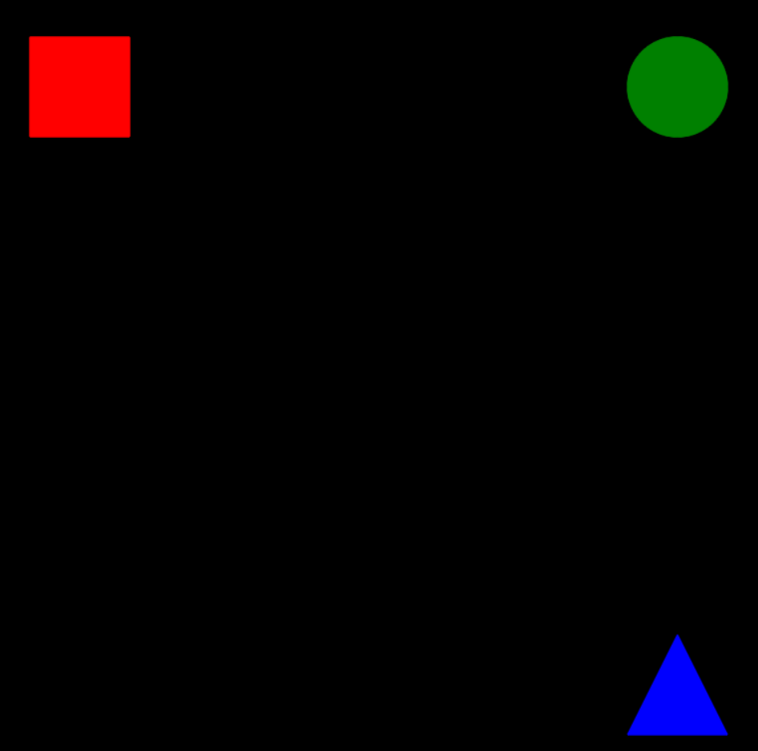
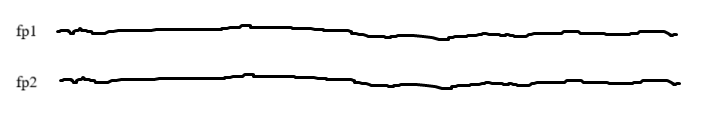
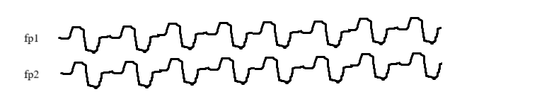
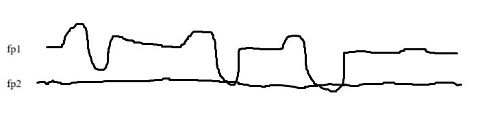
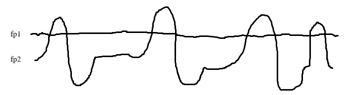

期末 Lab 3 紀錄

實作的部分嘗試很多方法，

1. [SSVEP](#SSVEP )
2. [FFT](#FFT)
3. [alpha 波](#alpha)
4. [blink eye (最後使用這個)](#blink_eye)

# SSVEP 

使用螢幕閃爍不同頻率來判斷 class，盯著不同平率來判斷不同腦波。建議不要使用這個，在蒐集資料會蒐集到眼睛瞎掉

## 蒐集資料

因為準確度很 real-time 上面實測問題，和螢幕閃爍頻率問題，這部分蒐集了很多不同的資料。

1. 螢幕同時閃爍 3 個頻率 
2. 螢幕閃爍分別 3 個頻率 (和蒐集完很多資料後才發現螢幕閃爍頻率不一樣...)

### 頻率固定

視窗都是使用 `psychopy` 實作

> 1

頻率的部分一開始使用 sin 波呈現，讓透明度會隨不同頻率的 sin 波變化

```python
clock = core.Clock()
while clock.getTime() < duration:
    t = clock.getTime()
    for i, stim in enumerate(stimuli):
        freq = frequencies[i]
        # sin波決定閃爍
        stim.opacity = 1.0 if np.sin(2 * np.pi * freq * t) > 0 else 0.0
        stim.draw()
    win.flip()
```

但是這個頻率並不會固定，每次執行頻率好像有所不同 (根據受試者反饋

> 2

後來使用下列方法，讓頻率是每次執行固定的，透過抓取

但是在參考網頁 https://omids.github.io/quickssvep/，發現頻率跟上面的並不一致

```python
frame_rate = win.getActualFrameRate(nIdentical=60, nMaxFrames=120, nWarmUpFrames=60)
n_frames = int(duration * frame_rate)
frames_per_cycle = frame_rate / target_freq
pattern = np.array([(i % frames_per_cycle) < (frames_per_cycle / 2) for i in range(n_frames)])
for i in range(n_frames):
	stimuli[target_idx].opacity = 1.0 if pattern[i] else 0.0
	stimuli[target_idx].draw()
	win.flip()
```


> 3

最後，發現還是使用 1 的方法，但是時間在最開始宣告，並改成取秒數是在哪裡為基準，頻率才達到穩定

```python
clock = core.Clock()
while clock.getTime() < duration:
	t = stim_clock.getTime() # 時間另外計算，在一開始就 declare
	phase = (t * frequencies[target_idx]) % 1  # 取 0~1
	stimuli[target_idx].opacity = 1.0 if phase < 0.5 else 0.0
	stimuli[target_idx].draw()
	win.flip()	
```


### 蒐集實際展示

`get_ssvep_data_simple.py`

訓練流程都一樣，每個 trail，中間出現十字(1s) -> cue(1s) -> 出現頻率圖片 (5s) -> rest (2s)

使用下圖三個頻率一張圖片



`get_sssvep_data_new.py`

使用像是下圖單個頻率和圖片


### 資料紀錄

每個人蒐集的 trail 數量，每個 trail 約為 6 秒 (有時候蒐集 trail 會沒有錄到 壬威 為最大受害者 XD

|        | simple (最開始，三個頻率) |   new (單個頻率)    |
| :----: | :-----------------------: | :-----------------: |
| 魏仲彥 |           `37`            |   `37*4+60*2=268`   |
| 張晉睿 |        `37*3=101`         |    `60*2+37=157`    |
| 林昱陞 |         `37*2=74`         |        `37`         |
| 賴壬威 |             0             | `90*2+15+16+60=271` |
| 陳柏翔 |             0             |          0          |

林昱陞 e 為 reasting state

## 訓練方法

這裡根據訓練 `get_sssvep_data_new.py` 的方法進行討論

使用 `SCCNet`、`EEGNet` 和 [`ESNet`](https://github.com/YuDongPan/SSVEPNet/blob/master/Model/SSVEPNet.py) 測試，準確度 EEGNet > ESNet> SCCNet ，模型複雜度 ESNet > SCCNet  > EEGNet 


### preprocess

為了模擬實際應用情況，所以選擇先切再 band pass，本來有 down sample to 250 Hz，但是後來發現不 down sample 反而效果更好，可能是因為含有更多數據可分析

先切 segments > padding > Bandpass filter (1 to 40 Hz) > 切掉多餘 padding 的 size > 回傳處理後的 segment

```python
# padding 後 Bandpass
s_padded = np.concatenate([
    s_ds[:buffer_ds][::-1],  # 前 buffer，反轉鏡像
    s_ds,
    s_ds[-buffer_ds:][::-1]  # 後 buffer，反轉鏡像
], axis=0)
s_f = filtfilt(b, a, s_padded, axis=0) # Bandpass filter
s_final = s_f[buffer_ds: -buffer_ds] # 裁掉 buffer 部分
```


#### train_parameter

`epochs=500, batch_size=16, learning rate=0.0001`


最後準確率每個人不同，每次蒐集資料然後測試準確率有時候為 0.5，有時候為 0.7 ，但是有時候準確率可以來到 9 成。但是準確率再高，最後實測的時候感覺都像是一坨 💩。


## online_test

這裡根據測試 `get_sssvep_data_new.py` 的方法進行討論

主程序 (`ssvep_window`) 顯示對應的頻率，並使用 wd 切換頻率，然後看看對應腦波有沒有顯示對應的 class

我們創建了三個 thread 第一個 (`read_eeg`) 用來讀取 eeg data，第二個 (`predict_loop`) 用來 prediction，最後一個 (`report_history`) 用來返回最後結果，前兩個 thread 有共用 global value buffer。

### read_eeg

在讀取 eeg data 的 thread 裡面

我們把 5 秒的資料存入到 buffer 裡面，然後 real time 讀取 cygenus 傳的資料，當數據滿五秒 (5*sample rate)，我們就讓一筆資料進來，一筆資料就出去。sample 取 4 個 channel data (fp1, pf2, o1, o2)

```python
sample, _ = inlet.pull_sample()
sample = np.array(sample[0:2] + sample[4:6]).reshape(-1, 1)  # shape: (4,1)
eeg_buffer[:, :-1] = eeg_buffer[:, 1:]  # 向左移動一格，丟掉最舊的
eeg_buffer[:, -1] = sample.flatten()
```


### predict_loop

在 prediciton，會使用之前訓練產出的模型 `train_n.pth`，load 模型後餵對應資料進去。資料餵進去之前會做前處裡

```python
outputs = model(x_batch)
prediction = int(torch.argmax(outputs).cpu().item())
history.append(prediction)
```


#### preprocess

這裡做的和訓練的時候做的很像 padding > Bandpass filter (1 to 40 Hz)

當資料都處裡完成後並得到預測結果，然後會把結果放入到 history 裡面。

### report_history

使用 history 紀錄之前幾個 prediction，讓輸出結果會是 histroy 裡面最多的結果。每 3 秒輸出一次最終結果


# FFT

嘗試使用 FFT 然後根據訓練資料產出的結果頻率來區分目前受試者想的是哪個頻率

使用 FFT 出來的 3 個 threshold 來判斷，但是在 print 出來 threshold 和 資料的數據後，發現變化很大，很難區分類別，所以後來就改嘗試其他方法


# alpha

因為在 [Mind-controlled-car](https://github.com/CECNL/BCI_lab1-Mind-controlled-car) 裡面使用 alpha 可以做簡單的二分類，然後那時候 SSVEP 效果又不是很好，所以我們改使用看看 alpha，然後把 alpha 改成用神經網路訓練然後測試

## 蒐集資料

使用 sounddevice 播放聲音，讓受試者聽到聲音後張眼閉眼，然後紀錄 start, end 和 label 到文件裡面

```python
t = np.linspace(0, duration, int(sr * duration), False)
tone = np.sin(freq * t * 2 * np.pi)
sounddevice.play(tone, sr)
```

### 資料紀錄

只有 昱陞 有蒐集資料，總共蒐集 `40*2` 個 trail，每個 trail 一共 10 秒 (一個 session 張眼閉眼 20 次)


最後在測試的時候，發現效果其實和使用 threshold 的差不多，都有點難控制。因為所剩時間不多，所以然後 昱陞 發現在 blink eye 的時候 fp1 fp2 的波形肉眼可見的變化，和單眼扎的時候可以控制 fp1 或是 fp2，所以最後改使用 blink eye 來判斷，不使用 ML，而是使用 raw eeg signal 直接判斷


# blink_eye

我們最後採用的方法，這個方法的正確率高的嚇人，尤其配上最強大腦 昱陞 後

### 波形特性

在沒有 blink eye 的時候波形很穩定



當我們雙眼一直 blink 的時候波形會如下，可以看到波形的強度明顯變大



當單眼 blink 的時候，會有特定的 channel 波形幅度變化，但是這個看人，如果不能只 blink 一眼，那就會另外一個 channel 也會跟者變化，單眼 blink 的強度比雙眼來的大很多





透過以上特性，我們設計一個根據波形強度來判斷使用者目前想要發送指令的系統

## method

透過計算 fp1 fp2 在一定時間內的強度，我們使用最大值和最小值計算

```python
amplitude_fp1 = np.max(eeg_buffer[0]) - np.min(eeg_buffer[0])
amplitude_fp2 = np.max(eeg_buffer[1]) - np.min(eeg_buffer[1])
```

然後把值存入 queue 裡面，讓最後結果輸入不要太不穩定

```python
fp1_amplitude_queue.append(amplitude_fp1)
fp2_amplitude_queue.append(amplitude_fp2)
```


我們 blink 判斷是根據 `CHECK_INTERVAL` 變數，最後測 0.2 判斷一次剛剛好


當強度超出我們的 threshold，那就代表使用者要執行對應的指令，我們只有三分類，因為我們的最強大腦說他左眼 blink 的時候右眼也會 blink。

```python
if fp1_moderate > half and fp2_moderate > half:
	blink_class = 3  # 中等強度同步 blink
	ser.write(b'4')  # 設定 turn right
elif fp2_strong > half and fp1_strong <= half:
	blink_class = 2  # 優先：右側強 blink
elif fp1_strong > half and fp2_strong <= half:
	blink_class = 1  # 優先：左側強 blink
	ser.write(b'1')  # 設定 car forward
else:
	blink_class = 0  # 無 blink
	ser.write(b'0')  # 設定 car stay
```


這個方法很看腦波，因為在一開始的時候腦波波形一定要穩，然後 blink 一定要有區分，才能使用這個方法。
